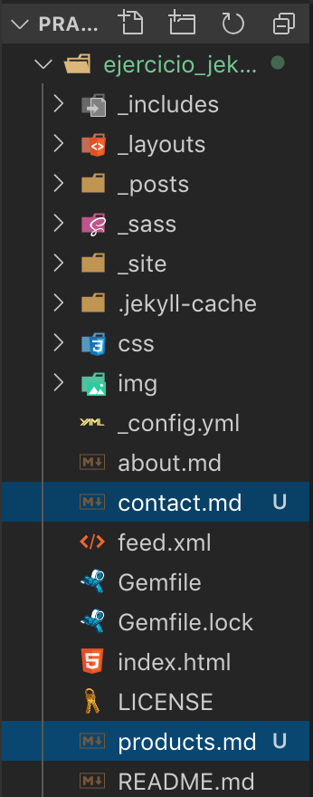
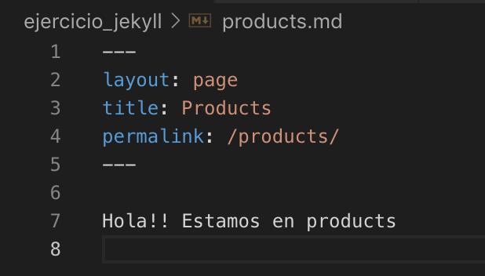
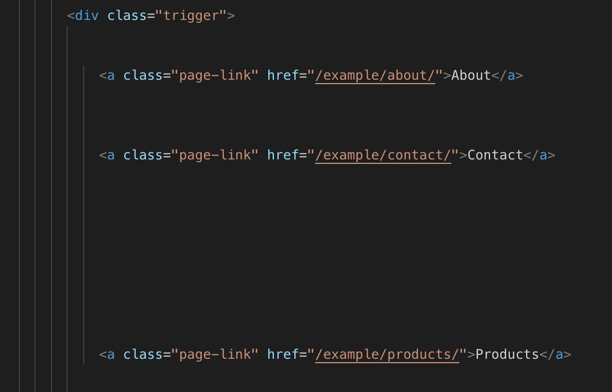

# Practica de Jekyll

* Alberto Martín Núñez

El objetivo de esta práctica es conocer como es una estrutura con Jekyll y realizar una serie de ejercicios y modificaciones para familiarizarnos con Jekyll.

## Índice de contenido
1. [Analizaremos el proyecto básico](#id1)
2. [Ejercicios realizados](#id2)

## 1. Analizaremos el proyecto básico <a name="id1"></a>

La estructura que viene predefinida en nuestro ejemplo la podemos ver en la siguiente imagen:


Podemos destacar de esta estructura cosas nuevas como:

* - Los includes --> Codigo html que se va a poder incluir
* - Los layouts --> Plantillas en donde vamos a incluir los ficheros
* - Los posts --> Donde crearemos y se almacenarán nuestros posts
* - _site --> Tendremos todo el contenido de nuestra página 

Para familiarizarnos con Jekyl vamos a hacer dos tareas: Añadiremos dos páginas y un post adicionales al proyecto.

# Añadiendo dos páginas adicionales al proyecto

Se le ha añadido dos páginas adicionales a este proyecto con Jekyl llamadas *Contact* y *Products* de la siguiente forma:

Se han creado dos ficheros **MarkDown** con cada nombre y se ha modificado dentro del fichero el *FronMatter* y se ha añadido un texto en negrita para corroborar que se crea esa página al pinchar en ella.


- Estructura con los ficheros markdown creados en el proyecto



- Contenido del fichero, en este caso de **productos**



- Elementos que se crean cuando ejecutas el server


- Como quedaría en el *index.html*




# Añadien un post al proyecto

Para añadir un nuevo post tendremos que ir a la carpeta **_posts** y crearnos un fichero *markdown* en donde indicaremos nuestro front matter con atributos como el nombre del layout,que se queda como *post*, el title del post, la fecha, etc y el contenido de este como vemos en la imagen. 

Una vez creado y con el server corriendo simplemente al guardar el archivo se nos crea automaticamente, en este caso, una carpeta con el año del post y dentro un *index.html* con el contenido que hemos añadido en él.


En la siguiente imagen podemos ver como aparecería el *post* en la pagina principal(*parte izquierda de la imagen*) y también como severía el post una vez entremos en él(*parte derecha de la imagen*).  


## 2. Ejercicios realizados <a name="id2"></a>

# Identifica objetos, filtros y etiquetas en el siguiente fragmento de código e indica cuál es u finalidad.

```
  
        `  
          `<div class="grid__cell grid__cell--33">
            `
          </div>
        

```

*SOLUCION:*

En este caso se asigna con una variable a "episodes", que no son ni más ni menos que trozos de codigo y estos se ordenan por su peso. Posteriormen te se hace un for en donde por cada episodio hasta el sexto se crea un **div** en donde se incluye un codigo *html*.

# Qué código html tendría como salida

```

<html>   
        <head>  
           <title>{{ page.title }} -Ejemplo Jekyll </title>
        </head>
        <body>  
           ` 
           {{ content }}
        </body>  
</html> 

```

*SOLUCION:*

Tendríamos en el head un titulo de la pagina con el nombre que se haya establecido en la variable title del layout con nombre **page** mas *"-Ejemplo Jekyll"*. 
En el cuerpo del html se incluye un fichero *nav.html* y posteriormente el contenido del layout por defecto.

# Especifica los filtros, variales Jekyll, tags, y qué se consigue con el siguiente código

```
<footer id="footer">
    <p class="small">© Copyright {{ site.time | date: '%Y' }} {{ site.author }}</p>
</footer>


```

*SOLUCION:*

En el codigo tenemos una etiqueta **footer** (pie de pagina). Dentro de ella hay otra etiquete **p**(párrafo) con una *clase* que se llama small y con un contenido "**© Copyright {{ site.time | date: '%Y' }} {{ site.author }}**" en donde podemos destacar las siguientes variable Jekyll:

- *site.time* devuelve la hora cuando se ejecuta Jekyll en el siguiente formato:
**2019-11-11 12:56:48 +0000**
Pero al aplicarle un filtro, `| date: '%Y'` , nos quedaríamos con el año por lo que el resultado seria : **2019**
- *site.author* devolveria el valor de la variable author que si no esta definida no tendría nada en su interior.

Por lo que el resultado del codigo anterior seria:

**© Copyright 2019**

# Indicar qué scripts se están invocando con el siguiente código

```
  <script src="https://ajax.googleapis.com/ajax/libs/jquery/2.1.1/jquery.min.js"></script>
  <script src="{{ "/" | relative_url  }}assets/js/main.js"></script>
  <script src="{{ "/" | relative_url  }}assets/js/highlight.js"></script>
  
```
*SOLUCION:*

En la primera línea esta incluyendo un script que viene dado por una ruta absoluta a la pagina donde esta alojado el fichero js.
En los otros dos casos esta usando la variable **baseurl**, que debe estar inicializada en el *_config.yml* y la esta añadiendo al principio de "/". 
Como en nuestro caso **baseurl** = "*/example*" los enlaces a los script quedarían de la siguiente forma:

 - */example/assets/js/highlight.js*
 - */example/assets/js/highlight.js*

# Indica el resultado que se obtiene con el siguiente código, sabiendo que paginas corresponde la colección de almacenada en _characters

```
<ul class="nav">
          
          
            <li class="nav__item">
              <a href="{{ pagina.url }}">{{ pagina.title }}</a>
            </li>
          
</ul>

```

*SOLUCION:*

En el anterior codigo se asigna a una variable *paginas* las paginas del sitio ordenadas por el nombre(variable *name*) y por casda pagina se añade un elemento **li** con un texto que es el titulo de la página con una dirección a la **url** de dicha página.

# Dada una colección de documentos con las siguientes variables en el frontmatter
```
title: Mi Pagina
thumbnail_url:  https://XXX
image_url: https://

```
Indicar que objetivo tiene el siguiente include:

```
<a href="{{ character.url }}" class="character-preview">
  
  <div class="character-preview__label">
    {{ character.title }}
  </div>
</a>

```

*SOLUCION:

En este ejercicio se crea un enlace a "url" que creo que estaría mal y que en realidad debería de estar *thumbnail_url*, ese enlace no es más ni menos que una imagen cuya url creo que tambien esta mal y tendría que ser *image_url*, junto con un **div** donde aparece el *titulo*.

