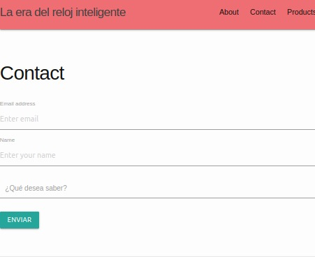

# Práctica de Jekyll

### Alberto Martín Núñez


## Objetivo de la práctica

El objetivo de esta práctica es crear una plantilla para una página con una estructura en forma de tarjetas.

## Realizacion de la práctica

Para realizar esta práctica me he basado en el **ejercicio de jekyll** en donde se ha creado una estructura base. En esta estructura base se ha modificado para tener un contenido acorde con la página creada, basada en la venta de *smart watch*. En ella tendremos nuestra pagina principal con los productos más vendido y una barra de navegacion con distintas pestañas: *About, Contact y Products*.


La pestaña About sobre la informacion de nuestra web:


La pestaña contacto con un pequeño formulario:



Y la pestaña de Productos con nuestra plantilla con tarjetas basadas en el uso de componentes de materialize(cards):


Para crear esa plantilla de productos se ha añadido una nueva carpeta *_character* en donde residiran en formato markdown la informacion de las distintas tarjetas que se van a crear. Posteriormente se llamará a estos fichero haciendo uso de la propiedad *site.character* para recorrerlas y añadirlas a nuestra página de productos:


Posteriormente solo habría que recorrerlos de la siguiente forma e ir insertanto entre llaves las variables descritas en el markdown para rellenar el contenido de las tarjetas:


```html
<div class="row">
        
        <div class="col s4 m3 l4">
            <div class="card grey" >
                <div class="card-image">
                    
                    <a class="btn-floating waves-effect waves-light red halfway-fab activator">
                    <i class="material-icons icon-plus">add</i>
                    </a>
                </div>
                <div class="card-content">
                    <span class="card-title">{{watch.title}}</span>
                    <p>{{watch.description}}</p>
                </div>
                <div class="card-action center">
                    <a href="{{watch.link}}">Oficial Site</a>
                    <a>{{watch.price}}</a>
                </div>
                <div class="card-reveal">
                    <span class="card-title">Los detalles del reloj<i class="material-icons right">close</i><p>Aqui esta todo el contenido del reloj</p>
                    </span>
                </div>
            </div>
        </div>
        
    </div>

```

